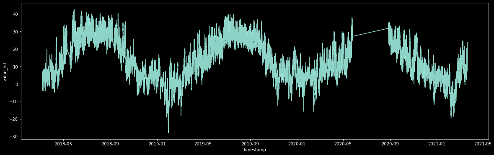

##  Array of Things (AoT)

Towards a deeper understanding of IoT Unsupervised Learning techniques and sensor KPI parameter anomaly detection for AI Edge Computing tactics


<br>


<dl>
<dt>Purpose</dt>
<dd>University of Michigan Milestone II</dd>
<dt>Author</dt>
<dd>Tom Bresee</dd>
<dt>Date</dt>
<dd>September 2021</dd>
</dl>

<br>


## Table of Contents

<!-- TOC depthFrom:1 depthTo:3 withLinks:1 updateOnSave:1 orderedList:0 -->

- [Table of Contents](#table-of-contents)
- [All Project Code](#all-project-code)
- [Motivation](#motivation)
- [What Data is Collected ?](#what-data-is-collected-?)
- [Data Deep Dive](#data-deep-dive)
- [References](#references)
	- [Technical Background and Overview](#technical-background-and-overview)
	- [Nodes](#nodes)
	- [Metadata](#metdata)
	- [API](#api)
- [Overall Project Code Methodology](#overall-project-code-methodology)
- [Unsupervised Learning Methods](#unsupervised-learning-methods)
- [All Project Code](#all-project-code)
	- [Jupyter Notebooks Code](#jupyter-notebooks-code)
- [Waggle](#waggle)
- [Nodes Network](#nodes-network)
- [Malfunction Information](#malfunction-information)
- [Ethical Implications](#ethical-implications)
- [Challenges](#challenges)
- [Observations and Discussion](#observations-and-discussion)
- [Appendix](#appendix)
  	- [A. Follow Up Research](#a-follow-up-research)
  	- [B. Sensor Malfunction Example](#b-sensor-malfunction-example)
  	- [C. All Sensors](#c-all-sensors)

<!-- /TOC -->

<br>

##  All Project Code
 
All code (python and jupyter notebooks) will be hosted within our main SensorAnalysis github 'code' folder [here](https://github.com/tombresee/SensorAnalysis/tree/main/ENTER/code), but for viewing ease, the following rendered links are provided (code, jupyter notebooks in nbviewer as well as html rendered view, in additions to result images).  If a link doesn't work the first time, give it a sec and retry, be patient, they are pretty big files...
	
- [All Jupyter Notebooks viewable via Nbviewer](https://nbviewer.jupyter.org/github/tombresee/SensorAnalysis/tree/main/ENTER/code/)
- [101 - Examining Sensor Metadata](https://nbviewer.jupyter.org/github/tombresee/SensorAnalysis/blob/main/ENTER/code/101_examining_sensor_metadata_csv_files.ipynb) [[html](https://ghcdn.rawgit.org/tombresee/SensorAnalysis/main/ENTER/code/101_examining_sensor_metadata_csv_files.html)]
- [102 - Dask Dataset Read-in and Processing](https://nbviewer.jupyter.org/github/tombresee/SensorAnalysis/blob/main/ENTER/code/102_dask_reading_processing_filtering.ipynb) [[html](https://ghcdn.rawgit.org/tombresee/SensorAnalysis/main/ENTER/code/102_dask_reading_processing_filtering.html)]
- [103 - Initial EDA Start](https://nbviewer.jupyter.org/github/tombresee/SensorAnalysis/blob/main/ENTER/code/103_initial_EDA_start.ipynb) [[html](https://ghcdn.rawgit.org/tombresee/SensorAnalysis/main/ENTER/code/103_initial_EDA_start.html)]
- [104 - Examining Sensor Node Positions](https://nbviewer.jupyter.org/github/tombresee/SensorAnalysis/blob/main/ENTER/code/104_examining_sensor_positions.ipynb) [[html](https://ghcdn.rawgit.org/tombresee/SensorAnalysis/main/ENTER/code/104_examining_sensor_positions.html)] [[viz](https://rawcdn.githack.com/tombresee/SensorAnalysis/0b1a54fcba14e4042fbc7534281b845a8134f2ec/ENTER/code/node_locations_visualized/index.html)]
- [105 - Holoviews Plotting](https://nbviewer.jupyter.org/github/tombresee/SensorAnalysis/blob/main/ENTER/code/105_holoviews_time_range.ipynb) [[html](https://ghcdn.rawgit.org/tombresee/SensorAnalysis/main/ENTER/code/105_holoviews_time_range.html)] [[output-pdf](https://github.com/tombresee/SensorAnalysis/raw/main/ENTER/results/holoviews_timeview.pdf)] [[png](https://raw.githubusercontent.com/tombresee/SensorAnalysis/main/ENTER/results/holoviews_window.png)]
  - If you open the .html, at the bottom you can move the sliding bar range (grey plot) to see the output in the above plot
  - [[plotly render](https://ghcdn.rawgit.org/tombresee/SensorAnalysis/main/ENTER/results/temp_1q_2019_chicago.html)]   
- [201 - DBSCAN start](https://nbviewer.jupyter.org/github/tombresee/SensorAnalysis/blob/main/ENTER/code/201_DBSCAN_start.ipynb) [[html](https://ghcdn.rawgit.org/tombresee/SensorAnalysis/main/ENTER/code/201_DBSCAN_start.html)] [[univariate data](https://raw.githubusercontent.com/tombresee/SensorAnalysis/main/ENTER/results/single_subsensor_temp_data_plotted_two_months.png)] [[iter1 clusters](https://raw.githubusercontent.com/tombresee/SensorAnalysis/main/ENTER/results/dbr_1.png)] [[anomalies](https://raw.githubusercontent.com/tombresee/SensorAnalysis/main/ENTER/results/pow.png)] [[closeup1](https://raw.githubusercontent.com/tombresee/SensorAnalysis/main/ENTER/results/dbr_1_r1.png)] [[closeup2](https://raw.githubusercontent.com/tombresee/SensorAnalysis/main/ENTER/results/dbr_1_r2e.png)] [[why](https://en.wikipedia.org/wiki/January%E2%80%93February_2019_North_American_cold_wave#:~:text=In%20late%20January%202019%2C%20a,killing%20at%20least%2022%20people.&text=As%20a%20result%2C%20February%202019,on%20record%20in%20these%20regions.)]
  - Clicking the 201 code directly also allows you to see the code rendered (or toggle the button to only see the plots/results)
- [202 - DBSCAN tuning](https://nbviewer.jupyter.org/github/tombresee/SensorAnalysis/blob/main/ENTER/code/202_DBSCAN_iterations.ipynb) [[html](https://ghcdn.rawgit.org/tombresee/SensorAnalysis/main/ENTER/code/202_DBSCAN_iterations.html)] [[iter1 clusters](https://raw.githubusercontent.com/tombresee/SensorAnalysis/main/ENTER/results/new_dbr_1.png)] [[anomalies](https://raw.githubusercontent.com/tombresee/SensorAnalysis/main/ENTER/results/pow.png)] [[closeup1](https://raw.githubusercontent.com/tombresee/SensorAnalysis/main/ENTER/results/dbr_1_r1.png)] [[closeup2](https://raw.githubusercontent.com/tombresee/SensorAnalysis/main/ENTER/results/dbr_1_r2e.png)] [[after tuning again](https://raw.githubusercontent.com/tombresee/SensorAnalysis/main/ENTER/results/pow_tuned_2.png)] [[why](https://en.wikipedia.org/wiki/January%E2%80%93February_2019_North_American_cold_wave#:~:text=In%20late%20January%202019%2C%20a,killing%20at%20least%2022%20people.&text=As%20a%20result%2C%20February%202019,on%20record%20in%20these%20regions.)]
- [204 - Isolation Forest Examination](https://nbviewer.jupyter.org/github/tombresee/SensorAnalysis/blob/main/ENTER/code/204_isolation_forest_working.ipynb) [[html](https://ghcdn.rawgit.org/tombresee/SensorAnalysis/main/ENTER/code/204_isolation_forest_working.html)] [[plotly data](https://rawcdn.githack.com/tombresee/SensorAnalysis/ceeb9b02bad78c4e138f6a451b62c1943764e145/ENTER/results/iso_forest_base_data_plotted.html)] [[data histogram](https://raw.githubusercontent.com/tombresee/SensorAnalysis/main/ENTER/results/histogram_isolation_forest.png)]  [[anoamly score](https://raw.githubusercontent.com/tombresee/SensorAnalysis/main/ENTER/results/histogram_anomaly_scores_isolation_forest.png)] [[awesome anomalies](https://rawcdn.githack.com/tombresee/SensorAnalysis/ceeb9b02bad78c4e138f6a451b62c1943764e145/ENTER/results/isolation_forest_final_AD_plotted_superhighres.html)]
- [206 - K-Means Clustering](https://nbviewer.jupyter.org/github/tombresee/SensorAnalysis/blob/main/ENTER/code/206_k_means_clustering.ipynb) 
[[html](https://ghcdn.rawgit.org/tombresee/SensorAnalysis/main/ENTER/code/206_k_means_clustering.html)]  [[4](https://raw.githubusercontent.com/tombresee/SensorAnalysis/main/ENTER/results/kmean_four_clusters_breakout.png)] [[6](https://raw.githubusercontent.com/tombresee/SensorAnalysis/main/ENTER/results/kmean_six_clusters_breakout.png)] [[calculated cluster viz](https://github.com/tombresee/SensorAnalysis/raw/main/ENTER/results/k_means_cluster_temperatures_output.pdf)]
[[elbow plot](https://raw.githubusercontent.com/tombresee/SensorAnalysis/main/ENTER/results/elbow_plot_kmeans_dual.png)]
[[optimal 3](https://raw.githubusercontent.com/tombresee/SensorAnalysis/main/ENTER/results/kmean_three_clusters_breakout.png)]
 
<br>

##  Motivation

As a continuing investigation into the realm of real-world sensor analytics, we focus on a massive Internet of Things (IoT) cluster known as the [Array of Things](http://arrayofthings.github.io/), hosted in the city of Chicago and part of a continuing effort for `smart city` enablement.  It is expected that smart city initiatives will progress, as Chicago takes the lead in deploying it's AoT cluster.  In recent years, the smart city concept has gone from theoretical to actual live production networks.  We leverage unsupervised machine learning tactics to dive deeper into a large set of this extensive AoT sensor data. The Array of Things (AoT) Chicago sensor network is an **extensive** cluster with software-defined units performing multiple sensing duties, as a true predecesor to a 'smart city'.  We have Folium (python geo-mapper) to plot all 126 current sensor node locations [here](https://rawcdn.githack.com/tombresee/SensorAnalysis/0b1a54fcba14e4042fbc7534281b845a8134f2ec/ENTER/code/node_locations_visualized/index.html), where clicking or hovering on the node shows its address and unique node_id.  This project was initially funded by the National Science Foundation to design and build a new kind of national-scale reusable cyberinfrastructure to enable AI at the edge. The project  leverages open source hardware/software developed by [Argonne National Laboratory](https://www.anl.gov/).  The supervised machine learning techniques were initially associated with our first dataset (the human activity recognization HAR dataset). This section details mainly the second part, which was to identify unsupervised machine learning techniques for an additional dataset. 

**The IoT sector is expected to be a billion dollar market as advances in computing, lower cost sensors, and 5G cellular technology progress.** We anticipate more and more IoT-related AI research is done into subjects such as sensor parameter key performance indicator (KPI) anomaly detection, sensor predictive maintenance, sensor malfunction estimation, and sensor status.  Our investigation revolved around clustering sensor data KPI values into 'normal' vs 'anomalous', as well as comparing individual cluster node data with other nodes. Specific unsupervised learning techniques involved are isolation forest, DBSCAN, <insert>, and <insert> clustering.   Part of the motivation for this project is the fact that this dataset represents a huge real-world non-synthetic view of sensor IoT program.  Many datasets from UCI or Kaggle are synthetic or run under laboratory-like conditions, however this dataset represents insight into how IoT sensors really perform, the good, the bad, the practical...
	
One of our goals is to create code to <ins>cluster</ins> streams of time-series data into normal, non-normal, and anomalous.  
	
<br>

##  Philosophy
Time series dataset machine learning examination is still really being developed, new methods are being created on a yearly basis.  This dataset allows one to create whole new approaches on how to deal with the challenging cases of longitudinal data and time-series for sensors.  Time series outputs depends on many factors (window size, algorithm, pre-filtering assumptions, etc), part of the exciting part is developing whole new ways of approaching this problem, given that subject matter expertise of the system is a key component.  It is estimated that with the continued rollout of **5G cellular technologies**, IoT processing and examination will skyrocket, give IoT can ride the 5G backhaul that will soon become a ubiquitous element of society...
	
	
<br>
 

##  What Data is Collected in the AoT Cluster ?  
- The sensor nodes measure items such as temperature, barometric pressure, light, vibration, magnetic fluctation, carbon monoxide, nitrogen dioxide, sulfur dioxide, ozone, ambient sound pressure, and pedestrian and vehicle traffic.  Continued research and development is using machine learning to create sensors to monitor other urban factors of interest such as solar light intensity (visible, UV, and IR) and cloud cover (important to building energy management), and flooding and standing water. 
- The Array of Things project is inherently interested in monitoring urban environment and activity, and not necessarily specific individuals.  The base technology and policy have been designed to specifically minimize any potential collection of data about individuals, so privacy protection is built into the design of the sensors and into the operating policies.  The goal is extensive smart city granular data.
- The specific AoT sensors and their measured parameters are listed [here](https://github.com/tombresee/SensorAnalysis/blob/main/ENTER/data/sensor_capabilities.csv).  
- For those interested in a smaller starter dataset, we consolidated, cleaned, and organized a smaller subset (parquet.zip form) on our AWS S3 [wolverine-tomahawk](https://wolverine-tomahawk.s3.us-east-2.amazonaws.com/aot/aot_temp_cleaned.parquet.gzip)
- Example of a calculated window for a single sensor subsystem's temperature data shown below (closeup image [here](https://raw.githubusercontent.com/tombresee/SensorAnalysis/main/ENTER/images/single_subsensor_temp_data_two_month.png))
	


<p align='center'><i>Fig: Single Sensor Two Month Window</i></p>
	
	
<br>
 
		

## Data Deep Dive
 
- The main dataset is consolidated into one massive (tar) compressed file and hosted [here](https://www.mcs.anl.gov/research/projects/waggle/downloads/datasets/index.php)
  - **filename** - AoT_Chicago.complete.latest.tar 
  - **uncompressed file size** - **320 GB** 
  - **compressed file size** - **33.73 GB**
  - **uncompressed file type** - .csv
  - **data date range** - March 2018 through April 2021 is the master time range represented in the data 
  - **granularity** - Every sensor parameter records parameter data every **25 seconds**
  - **raw rows of data** - Over four billion (4,195,104,977 unique observations)
  - **time period of data** - 2018-03-06 22:14:56 through 2021-03-22 05:18:42; representing 1,112 days, i.e. 3 years, 16 days
  - **granularity of data** - 25s increments for multiple sensors, multiple sensor substems, and multiple parameters
  - **total number of unique nodes** - 126
    - many nodes include chemical sensors, Alphasense OPN-N2 air quality sensors, and/or Plantower PMS7003 air quality sensors (data breaks this out by C, A, and P designator)
- **important variables** 
    - sensor node id 
    - subsystem type of sensor  
    - sensor parameter type (temperature, barometric pressure, etc)
    - sensor parameter data value (raw)
    - sensor parameter data value (human readable) - the most important value for analysis
- Note:  Sensors were initially deployed in waves, not all of them were turned 'up' at the exact same time...
- In addition, there is a more 'real-time' data API service available to pull the last week of data
   - This is found via the the API link: https://data.sagecontinuum.org/api
   - We have created python scripts to pull this data on a per node, per sensor, per parameter level
   - Detailed usage suggestions contained [here](https://github.com/waggle-sensor/waggle-beehive-v2/blob/main/docs/querying-measurements.md)

<br>

---
	
The sensor data digest (archive) contained the following files:

* `data.csv.gz` - Sensor data ordered by ascending timestamp
* `nodes.csv` - Nodes metadata
* `sensors.csv` - Sensor metadata
* `provenance.csv` - Provenance metadata

The `data.csv.gz` file is a compressed CSV with the following columns:

* `timestamp` - UTC timestamp of when the measurement was done
* `node_id` - ID of node which did the measurement
* `subsystem` - Subsystem of node containing sensor
* `sensor` - Sensor that was measured
* `parameter` - Sensor parameter that was measured
* `value_raw` - Raw measurement value from sensor
* `value_hrf` - Converted, "human readable" value from sensor

These fields will always be provided as a header (example): 
```
timestamp,node_id,subsystem,sensor,parameter,value_raw,value_hrf
2019/09/09 22:12:44,001e0610ba8f,lightsense,hih4030,humidity,NA,32.18
2019/09/09 22:12:44,001e0610ba8f,lightsense,hih4030,temperature,NA,48.55
2019/09/09 22:12:44,001e0610ba8f,lightsense,ml8511,intensity,9643,NA
2019/09/09 22:12:44,001e0610ba8f,lightsense,tmp421,temperature,NA,43.81
2019/09/09 22:12:44,001e0610ba8f,metsense,hih4030,humidity,450,NA
2019/09/09 22:12:44,001e0610ba8f,metsense,htu21d,humidity,NA,41.15
```

_Sensor data is ordered by ascending timestamp_

Additional information such each node's coordinates or each sensor units can be found
in the metadata. 
	
A sensor values may be marked `NA`, indicating that either the raw or HRF value is
unavailable.

The node metadata provides additional information about each of the AoT project's nodes. This
file is a CSV with the following fields:

* `node_id` - ID of node.
* `project_id` - ID of project which manages node
* `vsn` - Public name for node. The VSN is visible on the physical enclosure
* `address` - Street address of node installation
* `lat` - Latitude of node installation
* `lon` - Longitude of node installation
* `description` - More detailed description of node's build and configuration
* `start_timestamp` - Starting timestamp of node installation
* `end_timestamp` - Ending timestamp of node installation

These fields will always be provided as a header, for example:
```
node_id,project_id,vsn,address,lat,lon,description,start_timestamp,end_timestamp
001e0610ba46,AoT_Chicago,004,State St & Jackson Blvd Chicago IL,41.878377,-87.627678,AoT Chicago (S) [C],2017/10/09 00:00:00,
001e0610ba3b,AoT_Chicago,006,18th St & Lake Shore Dr Chicago IL,41.858136,-87.616055,AoT Chicago (S),2017/08/08 00:00:00,
001e0610ba8f,AoT_Chicago,00D,Cornell & 47th St Chicago IL,41.810342,-87.590228,AoT Chicago (S),2017/08/08 00:00:00,
001e0610ba16,AoT_Chicago,010,Ohio St & Grand Ave Chicago IL,41.891964,-87.611603,AoT Chicago (S) [C],2017/12/01 00:00:00,2018/06/04 00:00:00
```

Additional details about a node are contained in the description field. The letters
inside the brackets `[ ]` indicate:

* `C` - Node is equipped with chemical sensors
* `A` - Node is equipped with Alphasense OPN-N2 air quality sensor
* `P` - Node is equipped with Plantower PMS7003 air quality sensor

The **sensor metadata** provides additional information about each of the sensors published
by the project. This file is a CSV with the following fields:

* `ontology` - Ontology of measurement
* `subsystem` - Subsystem containing sensor
* `sensor` - Sensor name
* `parameter` - Sensor parameter
* `hrf_unit` - Physical units of HRF value
* `hrf_minval` - Minimum HRF value according to datasheet. Used as lower bound in range filter
* `hrf_maxval` - Maximum HRF value according to datasheet. Used as upper bound in range filter
* `datasheet` - Reference to sensor's datasheet

These fields will always be provided as a header (example):
```
ontology,subsystem,sensor,parameter,hrf_unit,hrf_minval,hrf_maxval,datasheet
/sensing/meteorology/pressure,metsense,bmp180,pressure,hPa,300,1100,"https://github.com/waggle-sensor/sensors/blob/master/sensors/airsense/bmp180.pdf"
/sensing/meteorology/temperature,metsense,bmp180,temperature,C,-40,125,"https://github.com/waggle-sensor/sensors/blob/master/sensors/airsense/bmp180.pdf"
/sensing/meteorology/humidity,metsense,hih4030,humidity,RH,0,100,"https://github.com/waggle-sensor/sensors/blob/master/sensors/airsense/htu4030.pdf"
/sensing/meteorology/humidity,metsense,htu21d,humidity,RH,0,100,"https://github.com/waggle-sensor/sensors/blob/master/sensors/airsense/htu21d.pdf"
```

More in-depth information about each sensor can be found at: https://github.com/waggle-sensor/sensors

The **provenance metadata** provides additional information about the origin of the
project digest. This file is a CSV with the following fields:

* `data_format_version` - Data format version
* `project_id` - Project ID
* `data_start_date` - Minimum possible publishing UTC timestamp
* `data_end_date` - Maximum possible publishing UTC timestamp. If no explicit date exists, the creation date is used
* `creation_date` - UTC timestamp this digest was created
* `url` - URL where this digest was provided

These fields will always be provide as a header, for example:
```
data_format_version,project_id,data_start_date,data_end_date,creation_date,url
1,AoT_Chicago.complete,2017/03/31 00:00:00,2018/04/10 15:34:36,2018/04/10 15:34:36,http://www.mcs.anl.gov/research/projects/waggle/downloads/datasets/AoT_Chicago.complete.latest.tar.gz
```

---

<br>
	
##  References 

### Technical Background and Overview 

- [Data Source](https://www.mcs.anl.gov/research/projects/waggle/downloads/datasets/index.php) -- Master file (_AoT_Chicago.complete.latest.tar_) that expands to 340 GB csv file
- [Unzipping Data Procedure](https://github.com/waggle-sensor/waggle/blob/master/data/aot-readme.md)  
- [Data Ontology](ENTER/docs/sensor_ontology.csv) -- Sensor breakout and parameter ranges 
- [High Level Overview](https://datasmart.ash.harvard.edu/news/article/a-guide-to-chicagos-array-of-things-initiative-1190)
- [Project Homepage](https://tombresee.github.io/SensorAnalysis/)
- [Heroku Results Summary Page](https://michigan-milestone.herokuapp.com/)

### Nodes 
- [Latest News AoT](http://arrayofthings.github.io/)
- [Latest Online Map](https://data.cityofchicago.org/Environment-Sustainable-Development/Array-of-Things-Locations-Map/2dng-xkng)
- [Latest Nodes Online](https://github.com/waggle-sensor/beehive-server/blob/master/publishing-tools/projects/AoT_Chicago.complete/nodes.csv)
- [Current Sensor List](http://arrayofthings.github.io/node.html)
- [Waggle Source Code Repo](https://github.com/waggle-sensor/waggle)
- [Common Waggle Sensors](https://github.com/waggle-sensor/sensors)
- [The Sage Network](https://sagecontinuum.org/)
- [Rollout Article](https://medium.com/array-of-things/five-years-100-nodes-and-more-to-come-d3802653db9f)
 
	
### Metadata
- [Waggle Source Code Repo](https://github.com/waggle-sensor/waggle)
- [In-depth Sensor Information](https://github.com/waggle-sensor/sensors)
- [Latest Sensors](https://github.com/waggle-sensor/beehive-server/blob/master/publishing-tools/projects/AoT_Chicago.complete/sensors.csv)


### API 
- [Original AoT API Link](https://arrayofthings.docs.apiary.io/#introduction/data,-entities-and-relationships/observations-and-metrics) - replaced by below 
- [API Access Page](https://arrayofthings.docs.apiary.io/#reference)
- [Access and Use Data](https://sagecontinuum.github.io/sage-docs/docs/tutorials/accessing-data)
- [Article](https://medium.com/array-of-things/array-of-things-releases-apis-for-chicago-data-enabling-applications-9bfdbe477df3)
- [Architecture](https://sagecontinuum.github.io/sage-docs/docs/about/arch-overview)
- [Beehive Server](https://github.com/waggle-sensor/beehive-server)
- [Real Time Querying Data via API](https://github.com/waggle-sensor/waggle-beehive-v2/blob/main/docs/querying-measurements.md#query-api)
- [Filtering Mechanisms Explained](https://github.com/waggle-sensor/waggle-beehive-v2/blob/main/docs/querying-measurements.md#query-api)

Note: Unlike the bulk downloads, which provide data in daily, weekly, or monthly installments back to early 2017, the API data is focused only on recent data, going back one week. However, the data are updated more frequently, within five minutes of collection.
	
		
<br>

## Overall Project Code Methodology

Briefly describe the workflow of your source code, the learning methods you used, and the feature representations you chose.
How did you tune parameters?
What challenges did you encounter and how did you solve them?


	
### Reading Dataset
Our main data file was in compressed tar format. This main file was downloaded, and the archive was untared, which produced a directory. We unpacked this data archive, and the archive decompressed to a huge CSV file about 10 times its original size (ending up being over 320 GB in total size).  We leveraged [Dask](https://dask.org/) for the initial assimilation of the data, due to it's massive size and inability to fit into conventional RAM memory.  Initially, we created a single massive dataframe which encompassed all sensor data over all the years (with 25s granularity) associated with one (of the 126) node locations, and also cleaned that data and exported it to parquet format, which we had excellent results with for speed of calculations and IO functionality. This served as our initial examination, until we expanded to multiple sets of nodes. 
	
### Unsupervised Learning Methods
We will describe the workflow of the source code, the leaning methods used, and the feature representation used. 

Focused on investigating anomalies via Isolation Forest, DBSCAN, HDBSCAN, and abc.*
	
**Isolation Forest**
abc 
	
**DBSCAN**
It should be noted that with time-series it is not really feasible to dynamically determine the number of 'clusters' prior, thus using an algorithm like DBSCAN for time series data, Density Based Spatial Clustering of Applications with Noise (DBSCAN) becomes a nice approach, as it does not require any predefined number of clusters and has only two parameters (minimum number of points in a cluster and epsilon, distance between clusters), it is relatively fast as well. Optimal eps was abc.   DBSCAN does not require k (number of clusters) as the input. 

As the min_window hyperparameter increased, we observed increase in number of identified anomaly point count within cluster '-1'.  What worked here was creating a 'gridspec' like matrix of eps vs min_windows.  By virtue of the type of data we had, we actually had very small eps values (per expectation).  As eps increased, we observed...
	
	
Image below of two month window (closeup image can be found [here](https://raw.githubusercontent.com/tombresee/SensorAnalysis/main/ENTER/images/single_subsensor_temp_data_two_month_dbscan_clusters.png))


<p align='center'><i>Fig: DBSCAN Two-Month Window Temperature Anomalies</i></p>

	
**Challenges encountered and how we solved them:** 
- Interesting:  The Jan/Feb 2019 cold wave (polar vortex) was so bad that smashed into the USA, it got its own wikipedia page [link](https://en.wikipedia.org/wiki/January%E2%80%93February_2019_North_American_cold_wave)
- Tuning DBDSCAN is not an easy thing, lot of trial and error and tuning
- Window size matters alot, if you grab too wide, you miss nuance.  If you choose to small, you pick up abc.  But anomalies are contextual, an anomaly in Jan (window two months), may not show up if window was four months... So it is all 'relative'
	
<br>
 

## Waggle
-  The Waggle Platform is an open source software and hardware platform
for intelligent sensors with advanced edge computing and support for
machine learning.  The Waggle Platform is used by several wireless
sensor projects, including the Array of Things project
(https://arrayofthings.github.io).  For more information on the Waggle
Platform, see http://www.wa8.gl for details.
 
  
<br>
  
	
 
##  Nodes Network
- The nodes allow the city to track vehicle and pedestrian collisions to understand which intersections or traffic flows lead to pedestrian deaths and make urban planning changes accordingly.
- Chicago has one of the worst incidences of asthma mortality in the country; the nodes can help monitor air pollutant levels across the city and take appropriate measures where necessary.
- Time-stamped pickup and drop-off data on 230mm total trips from both taxies and rideshare apps provide a wealth of information on how residents move through the city, which the city can use to improve efficiency of city operations.
- The nodes can be used for different purposes depending on the area: the Chicago West and South sides commonly have flooding issues during rainstorms, and the nodes can be used to detect standing water, thus helping city employees identify bottlenecks in the city’s sewer system.
- _These sensors are **ideal** for health, environmental, industrial and residential monitoring, because of their high performance, low cost and small size._


<br>

##  Malfunction Information
- The 3SP-CO-1000 sensor is not intended for continuous operation at <10% RH. Extended periods (>60-90 days) of operation in <10% humidity may permanently damage the sensor. One conceivable examination point may be to see if we can predict or determine when the sensor has malfunctioned. 
- Determining when the temperature sensor for instance has stopped working effectively, or is giving unusual results (which one could classify as an anomaly or stream of anomalies). 

	
																  
<br> 
	
##  Ethical Implications
- Initial privacy policy for the original AoT network are documented [here](https://arrayofthings.github.io/privacypolicy.html)
- [Original Civic Engagement Report](https://arrayofthings.github.io/engagement-report.html)
- According to the original AoT sensor network design, the sensors do **not** have the capability to measure or identify individuals; microphones and cameras in public spaces do not collect sensitive personally identifiable information (PII). 
- Microphone and camera images will be processed in near-real-time within the installed equipment, not transmitted or stored, with the exception of less than 1% of images at random times, saved for the purposes of image processing software calibration. Although these images will not contain PII, they will be controlled and protected with the same measures typically afforded PII. 
- During the 2016-2017 pilot period, the cameras were used for the purposes of detecting and publishing (a) count/flow of pedestrians, (b) count and flow of various vehicle types, and (c) extent to which road surface is covered with standing water (flooding). 

	
<br>
    
## Challenges
**File Size** -- The massive size of the core csv datafile (over 300GB) was difficult to parse through due to the memory size requirements, including the limitation of pandas. All efforts were made to parallel process the files via multiple PC cores.  In addition, Dask was used to initially filter the file due to its ability to handle massive file sizes.  Indexing was done to speed up process. The dataset itself just to filter through it is time-consuming due to its size.  This resulted in many cycles of time lost. 

**Complexity** -- Time-series anomaly detection (for univariate streams) is not always easy for anomaly detection analysis, and the size of the actual window under examination makes a substantial difference in results sometimes. Paradox: When you have a large data set, what window size do you use ?  AD is heavily dependent on window size and window placement. 
	
**UML** -- Tuning parameters for DBSCAN is sometimes limited, due to the need for subject-matter expertise of the actual dataset itself.  High computational costs for algorithms such as DBSCAN - High computational expense of average O(n log(n)) coming from a need to execute a neighbourhood query for each point; killing my time...also, the quality of the clustering results strongly depends on the measure you choose to compare the time-series (the standard euclidean distance measure may not be ideal for time-series, maybe). 
	
**Real-World Issues** -- Filtering: There were some sensors that flat-lined at some point for a window of time (conventional malfunction), these windows were documented 
	
**Plotting** -- It should be understood that given the granular nature of the streaming data (every 25-30s), a single dimension single variate parameter results in over 1M observations per year.  Thus plotting in larger window sizes required using high level plotting libraries such as Matplotlib/Seaborn, but for shorter timeframes where real-time granularity was necessary, Altair and Plotly were used. Plotly was also used in some cases so that the Dash version of the plots could be plotted online (heroku). 
		
<br>
	
	
## Observations and Discussion

<b>What we learned</b>
- When dealing with very large sets of data, it is *critical* to know Dask (and also fundamental Dask concepts like partition sizes, block sizes, persist vs compute commmands, etc), parquet-based dataframe forms, multiprocessing on pandas, and any edge on speeding up dataframe processing. This should all be know prior to processing large datasets or unforgivable amounts of time are lost.
- Grouping time-series data into clusters is sometime quite subjective; 'subject-matter expertise' and judgement calls become key component of the process.
	

<b>The suprising elements of the results</b>
1. The anomalous datapoint count varied dramatically based on input hyperparameters
1. It was **startling** how well DBSCAN worked in terms of identifying anomalies, but also how accurate it seemed to be in identifying clusters of unusual data values that were not necessarily defined as anomalies, but also were not part of the main 'group' (cluster 0).  These clusters were in someway abnormal but not anomalous...


<b>Extended Solution Thoughts</b> 
- With more time/resources, investigation into brand-new approaches such as Matrixprofile [[mpf](https://www.cs.ucr.edu/~eamonn/MatrixProfile.html)] [[matrixprofile foundation](https://matrixprofile.org/)] would have been fascinating to leverage
	
	
<br>	
	
 
##  Appendix

#### A. Follow Up Research
- Deeper examinination into time-series clustering
- Deeper analysis of how to effectively do anomaly detection on time-series where the data is not necessarily cyclic, periodic, or un'wavering'
- Developing a sliding-window based approach, to use the real-time API to determine update anomalies over the course of time (a truly dynamic anomaly detection system)

<br>
	
#### B. Sensor Malfunction Example
Periodically, some sensors would have windows of missing values (temperature in this sensor's case).  It is difficult to determine if this was due to potential sensor malfunction (or perhaps software update, etc).  


<p align='center'><i>Fig: Potential Malfunctioning Window</i></p>

<br>
	
#### C. All Sensors

|     | node_id      | address                                                     |     lat |      lon | start_timestamp     |
|----:|:-------------|:------------------------------------------------------------|--------:|---------:|:--------------------|
|   0 | 001e0610ba46 | State St & Jackson Blvd Chicago IL                          | 41.8784 | -87.6277 | 2017/10/09 00:00:00 |
|   1 | 001e0610ba3b | 18th St & Lake Shore Dr Chicago IL                          | 41.8581 | -87.6161 | 2017/08/08 00:00:00 |
|   2 | 001e0610f02f | Lake Shore Drive & Fullerton Ave Chicago IL                 | 41.9263 | -87.6308 | 2018/05/07 00:00:00 |
|   3 | 001e0610ba8f | Cornell & 47th St Chicago IL                                | 41.8103 | -87.5902 | 2017/08/08 00:00:00 |
|   4 | 001e0610ba16 | Homan Ave & Roosevelt Rd Chicago IL                         | 41.8663 | -87.7105 | 2018/07/18 00:00:00 |
|   5 | 001e06107e5d | State St & Washington St Chicago IL                         | 41.8832 | -87.6278 | 2016/09/14 00:00:00 |
|   6 | 001e0610ba8b | Stony Island Ave & 63rd St Chicago IL                       | 41.7806 | -87.5865 | 2018/02/26 00:00:00 |
|   7 | 001e0610ba13 | 7801 S Lawndale Ave Chicago IL                              | 41.7512 | -87.713  | 2018/01/01 00:00:00 |
|   8 | 001e0610ba18 | Damen Ave & Cermak Chicago IL                               | 41.8522 | -87.6758 | 2017/12/15 00:00:00 |
|   9 | 001e0610bc10 | State St & 87th Chicago IL                                  | 41.7363 | -87.6242 | 2018/02/22 00:00:00 |
|  10 | 001e0610bbf9 | Western Ave & 69th St Chicago IL                            | 41.7683 | -87.6834 | 2018/02/13 00:00:00 |
|  11 | 001e0610bbff | Western Ave & 18th St Chicago IL                            | 41.8578 | -87.6858 | 2017/12/15 00:00:00 |
|  12 | 001e0610b9e7 | Western Blvd & 35th St Chicago IL                           | 41.8304 | -87.6849 | 2017/02/02 00:00:00 |
|  13 | 001e0610ba15 | Jeffrey Ave & 95th St Chicago IL                            | 41.7225 | -87.5754 | 2018/02/22 00:00:00 |
|  14 | 001e0610bbe5 | Martin Luther King Dr & 87th St Chicago IL                  | 41.7365 | -87.6145 | 2018/02/16 00:00:00 |
|  15 | 001e0610ee33 | Damen Ave & Wilson Ave Chicago IL                           | 41.9651 | -87.6791 | 2018/02/15 00:00:00 |
|  16 | 001e0610b9e5 | Sheridan Rd & Granville Ave Chicago IL                      | 41.9946 | -87.6555 | 2017/11/28 00:00:00 |
|  17 | 001e0610f8f4 | Halsted St & 34th St Chicago IL                             | 41.8326 | -87.6461 | 2018/02/13 00:00:00 |
|  18 | 001e0610ee41 | Wood St & Warren Blv Chicago IL                             | 41.8823 | -87.6718 | 2017/12/01 00:00:00 |
|  19 | 001e0610eef4 | Milwaukee Ave & Wabansia Ave Chicago IL                     | 41.9127 | -87.6811 | 2017/10/09 00:00:00 |
|  20 | 001e0610ef29 | Martin Luther King Dr & 83rd St Chicago IL                  | 41.7438 | -87.6147 | 2018/02/16 00:00:00 |
|  21 | 001e0610f668 | Damen Ave & Archer Chicago IL                               | 41.8318 | -87.6753 | 2017/12/15 00:00:00 |
|  22 | 001e0610f730 | Campbell Ave & Addison St Chicago IL                        | 41.9467 | -87.6907 | 2017/03/31 00:00:00 |
|  23 | 001e0610bc07 | Kedzie Ave & 5th Ave Chicago IL                             | 41.8784 | -87.706  | 2017/11/20 00:00:00 |
|  24 | 001e0610ef26 | Halsted St & Randolph St Chicago IL                         | 41.8843 | -87.6474 | 2017/12/01 00:00:00 |
|  25 | 001e0610ea5a | 606 Path & Milwaukee Ave Chicago IL                         | 41.9142 | -87.683  | 2018/01/11 00:00:00 |
|  26 | 001e0610ee61 | Pulaski Rd & Madison St Chicago IL                          | 41.8807 | -87.7257 | 2017/11/20 00:00:00 |
|  27 | 001e0610ba81 | Lake Shore Drive & 85th St Chicago IL                       | 41.7411 | -87.5405 | 2017/11/29 00:00:00 |
|  28 | 001e0610ba57 | Western Ave & Madison St Chicago IL                         | 41.8812 | -87.6864 | 2017/11/20 00:00:00 |
|  29 | 001e0610ee82 | Damen Ave & Webster Chicago IL                              | 41.9214 | -87.6778 | 2018/02/15 00:00:00 |
|  30 | 001e0610ef27 | Western Ave & 25th St Chicago IL                            | 41.8466 | -87.6856 | 2017/12/15 00:00:00 |
|  31 | 001e0610fb4c | Leavitt St & Milwaukee Ave Chicago IL                       | 41.9136 | -87.6824 | 2017/10/09 00:00:00 |
|  32 | 001e0610ee6f | Damen Ave & Chicago International Produce Market Chicago IL | 41.8469 | -87.6731 | 2017/11/20 00:00:00 |
|  33 | 001e0610ef68 | Ashland Ave & 18th St Chicago IL                            | 41.8578 | -87.6661 | 2017/11/20 00:00:00 |
|  34 | 001e0610e809 | Ashland Ave & Division St Chicago IL                        | 41.9033 | -87.6674 | 2017/10/09 00:00:00 |
|  35 | 001e0610ee36 | Cottage Grove Ave & 79th St Chicago IL                      | 41.7513 | -87.6053 | 2018/02/22 00:00:00 |
|  36 | 001e061135cb | Ashland & 63rd St Chicago IL                                | 41.7794 | -87.6644 | 2018/02/13 00:00:00 |
|  37 | 001e0610e532 | Racine Ave & 18th St Chicago IL                             | 41.858  | -87.6564 | 2017/12/15 00:00:00 |
|  38 | 001e0610e8cb | Western Ave & Addison St Chicago IL                         | 41.9467 | -87.6883 | 2018/03/14 00:00:00 |
|  39 | 001e0610ee5d | Long Ave & Fullerton Ave Chicago IL                         | 41.924  | -87.7611 | 2018/02/23 00:00:00 |
|  40 | 001e0610ef73 | 7801 S Lawndale Ave Chicago IL                              | 41.7511 | -87.713  | 2017/01/01 00:00:00 |
|  41 | 001e0610e540 | Fort Dearborn Dr & 31st St Chicago IL                       | 41.8386 | -87.6078 | 2017/11/29 00:00:00 |
|  42 | 001e0610f6dd | Pulaski Rd & Chicago Ave Chicago IL                         | 41.8954 | -87.7261 | 2018/02/06 00:00:00 |
|  43 | 001e06113ad8 | Ashland Ave & Roosevelt Rd Chicago IL                       | 41.8668 | -87.6663 | 2018/02/27 00:00:00 |
|  44 | 001e0611441e | Ashland Ave & 47th Chicago IL                               | 41.8086 | -87.665  | 2018/02/27 00:00:00 |
|  45 | 001e06113d83 | Clybourn Ave & North Ave Chicago IL                         | 41.9109 | -87.6495 | 2018/02/23 00:00:00 |
|  46 | 001e06112e77 | Ashland Ave & 59th St Chicago IL                            | 41.7868 | -87.6643 | 2018/02/26 00:00:00 |
|  47 | 001e0610f6db | Hutchinson Commons UChicago Chicago IL                      | 41.7913 | -87.5987 | 2018/03/15 00:00:00 |
|  48 | 001e06115365 | UChicago Chicago IL                                         | 41.7884 | -87.5991 | 2018/04/02 00:00:00 |
|  49 | 001e06113cff | 7801 S Lawndale Ave Chicago IL                              | 41.7511 | -87.713  | 2017/01/01 00:00:00 |
|  50 | 001e0611537d | Ratner Hall UChicago Chicago IL                             | 41.7942 | -87.6016 | 2018/03/15 00:00:00 |
|  51 | 001e06113107 | 7801 S Lawndale Ave Chicago IL                              | 41.7511 | -87.713  | 2017/01/01 00:00:00 |
|  52 | 001e06114fd4 | Martin Luther King Dr & Garfield Blvd Chicago IL            | 41.7945 | -87.616  | 2018/03/08 00:00:00 |
|  53 | 001e0610890f | UChicago, Smart Museum Chicago IL                           | 41.7933 | -87.6001 | 2018/04/12 00:00:00 |
|  54 | 001e06113ad6 | Milwaukee Ave & Wood St Chicago IL                          | 41.9065 | -87.6714 | 2018/03/09 00:00:00 |
|  55 | 001e06109f62 | Pulaski Rd & 27th St Chicago IL                             | 41.8424 | -87.7245 | 2018/07/18 00:00:00 |
|  56 | 001e06113ace | Martin Luther King Dr & 35th St Chicago IL                  | 41.8311 | -87.6173 | 2018/03/08 00:00:00 |
|  57 | 001e061146bc | Ashland Ave & Elston Ave Chicago IL                         | 41.9187 | -87.6683 | 2018/02/28 00:00:00 |
|  58 | 001e06113a24 | UChicago, Oriental Museum Chicago IL                        | 41.789  | -87.598  | 2018/04/12 00:00:00 |
|  59 | 001e061144cd | Ashland Ave & Harrison St Chicago IL                        | 41.8742 | -87.6666 | 2018/05/31 00:00:00 |
|  60 | 001e061146cb | 606 Path & Miwaukee Ave Chicago IL                          | 41.9141 | -87.683  | 2018/01/11 00:00:00 |
|  61 | 001e061144d6 | 93rd St & Cottage Grove Ave Chicago IL                      | 41.7294 | -87.6046 | 2018/03/30 00:00:00 |
|  62 | 001e0610e539 | Cicero Ave & Madison St Chicago IL                          | 41.8805 | -87.7453 | 2018/02/05 00:00:00 |
|  63 | 001e0610f703 | Damen Ave & Polk St Chicago IL                              | 41.8715 | -87.6764 | 2018/02/06 00:00:00 |
|  64 | 001e0610b9e9 | Broadway Ave & Lawrence Ave Chicago IL                      | 41.969  | -87.6597 | 2018/02/14 00:00:00 |
|  65 | 001e0611462f | Wallace St & Pershing Rd Chicago IL                         | 41.8235 | -87.6411 | 2018/02/27 00:00:00 |
|  66 | 001e06115369 | Pulaski Rd & Addison St Chicago IL                          | 41.9464 | -87.7274 | 2018/02/23 00:00:00 |
|  67 | 001e06113d78 | Cottage Grove Ave & 95th St Chicago IL                      | 41.722  | -87.6045 | 2018/05/31 00:00:00 |
|  68 | 001e0610bc12 | Ashland Ave & 79th St Chicago IL                            | 41.7503 | -87.6635 | 2018/02/08 00:00:00 |
|  69 | 001e0610e835 | Damen Ave & Lawrence Ave Chicago IL                         | 41.9688 | -87.6792 | 2018/02/15 00:00:00 |
|  70 | 001e0610e538 | Cottage Grove Ave & 87th St Chicago IL                      | 41.7366 | -87.6048 | 2018/02/16 00:00:00 |
|  71 | 001e0610eef2 | Clark St & Wilson Ave Chicago IL                            | 41.9653 | -87.6667 | 2018/02/14 00:00:00 |
|  72 | 001e061130f4 | Chicago Ave & Noble St Chicago IL                           | 41.8962 | -87.6624 | 2018/02/06 00:00:00 |
|  73 | 001e0610ee43 | UChicago Chicago IL                                         | 41.7886 | -87.5987 | 2018/02/23 00:00:00 |
|  74 | 001e0610f05c | Western Ave & Fullerton Ave Chicago IL                      | 41.9249 | -87.6877 | 2018/02/07 00:00:00 |
|  75 | 001e0610f732 | Cicero Ave & Chicago Ave Chicago IL                         | 41.895  | -87.7458 | 2018/02/05 00:00:00 |
|  76 | 001e06113100 | Cottage Grove Ave & 111th St Chicago IL                     | 41.6928 | -87.6099 | 2018/02/08 00:00:00 |
|  77 | 001e0610e537 | Clark St & Montrose Ave Chicago IL                          | 41.9616 | -87.6659 | 2018/02/14 00:00:00 |
|  78 | 001e0610f513 | Milwaukee & Belmont Chicago IL                              | 41.9391 | -87.7238 | 2018/02/28 00:00:00 |
|  79 | 001e06109416 | Elston and Cortland Chicago IL                              | 41.9166 | -87.6664 | 2018/01/01 00:00:00 |
|  80 | 001e061146d6 | Halsted St & Division St Chicago IL                         | 41.9036 | -87.6481 | 2018/02/28 00:00:00 |
|  81 | 001e06113d22 | Kedzie Ave & 51st St Chicago IL                             | 41.8008 | -87.7037 | 2018/03/02 00:00:00 |
|  82 | 001e06113ae8 | UChicago, Law School Chicago IL                             | 41.7954 | -87.5996 | 2018/04/12 00:00:00 |
|  83 | 001e06113d20 | Ohio St & Grand Ave Chicago IL                              | 41.892  | -87.6116 | 2018/05/17 00:00:00 |
|  84 | 001e06114503 | Ave O & 126th Chicago IL                                    | 41.6661 | -87.5394 | 2018/03/02 00:00:00 |
|  85 | 001e06113dbc | Ave L & 100th St Chicago IL                                 | 41.7139 | -87.5365 | 2018/03/01 00:00:00 |
|  86 | 001e061144c0 | Pulaski Rd & 71st St Chicago IL                             | 41.7641 | -87.7224 | 2018/03/02 00:00:00 |
|  87 | 001e06114fcf | Lake Shore Drive & Irving Park Rd Chicago IL                | 41.9548 | -87.6452 | 2018/05/07 00:00:00 |
|  88 | 001e061146d4 | Torrence Ave & Brainard Ave Chicago IL                      | 41.6585 | -87.5591 | 2018/05/31 00:00:00 |
|  89 | 001e06109401 | Cottage Grove Ave & 115th St Chicago IL                     | 41.6854 | -87.6111 | 2018/05/31 00:00:00 |
|  90 | 001e06115382 | State St & Monroe St Chicago IL                             | 41.8808 | -87.6278 | 2018/03/23 00:00:00 |
|  91 | 001e06113cf1 | State St & Randolph St Chicago IL                           | 41.8847 | -87.6279 | 2018/03/23 00:00:00 |
|  92 | 001e06113acb | Ashland Ave & 31st Pl Chicago IL                            | 41.8391 | -87.6657 | 2018/04/12 00:00:00 |
|  93 | 001e06113f54 | Michigan Ave & Randolph St Chicago IL                       | 41.8846 | -87.6246 | 2018/05/07 00:00:00 |
|  94 | 001e06114500 | Halsted St & 99th St Chicago IL                             | 41.7145 | -87.6431 | 2018/03/13 00:00:00 |
|  95 | 001e06113d32 | Western Ave & Addison St Chicago IL                         | 41.9471 | -87.6883 | 2018/03/14 00:00:00 |
|  96 | 001e061146ba | Long Ave & Lawrence Ave Chicago IL                          | 41.9676 | -87.7626 | 2018/03/15 00:00:00 |
|  97 | 001e06113a48 | Western Ave & Roscoe Ave Chicago IL                         | 41.9433 | -87.6881 | 2018/03/15 00:00:00 |
|  98 | 001e06113ba6 | Ashland Ave & Washington Chicago IL                         | 41.8835 | -87.6667 | 2018/03/19 00:00:00 |
|  99 | 001e06115379 | N Wells St & W Washington St Chicago IL                     | 41.8833 | -87.6339 | 2018/03/27 00:00:00 |
| 100 | 001e06114fd6 | Upper Wacker Dr & Randolph St Chicago IL                    | 41.8845 | -87.637  | 2018/05/07 00:00:00 |
| 101 | 001e0611463b | UChicago, Shapiro Hall Chicago IL                           | 41.7897 | -87.5871 | 2018/12/04 00:00:00 |
| 102 | 001e0611536c | Dearborn St & Lake St Chicago IL                            | 41.8858 | -87.6297 | 2018/05/08 00:00:00 |
| 103 | 001e06114fd9 | Lake Shore Drive & Fullerton Ave Chicago IL                 | 41.9262 | -87.6315 | 2018/06/04 00:00:00 |
| 104 | 001e0611850f | 111th St & Martin Luther King Dr Chicago IL                 | 41.6928 | -87.6134 | 2019/06/24 00:00:00 |
| 105 | 001e06118501 | Morgan Ave & 63rd St Chicago IL                             | 41.7798 | -87.6491 | 2019/04/25 00:00:00 |
| 106 | 001e0611856d | 107th St & Longwood Ave Chicago IL                          | 41.6992 | -87.6712 | 2019/06/25 00:00:00 |
| 107 | 001e061184a3 | 99th St & Beverly Blvd Chicago IL                           | 41.714  | -87.6596 | 2019/06/25 00:00:00 |
| 108 | 001e06117b44 | 95th St & Ashland Ave Chicago IL                            | 41.7213 | -87.6626 | 2019/06/25 00:00:00 |
| 109 | 001e061183f3 | 103rd & Western Ave Chicago IL                              | 41.7064 | -87.6816 | 2019/06/25 00:00:00 |
| 110 | 001e06117b41 | 60th & Michigan Ave Chicago IL                              | 41.7857 | -87.6222 | 2019/05/16 00:00:00 |
| 111 | 001e061182a1 | Garfield Blvd & Michigan Ave Chicago IL                     | 41.7945 | -87.6225 | 2019/05/16 00:00:00 |
| 112 | 001e061183eb | 63rd St & Halsted Ave Chicago IL                            | 41.7799 | -87.6448 | 2019/05/16 00:00:00 |
| 113 | 001e061183f5 | 111th & Michigan Ave Chicago IL                             | 41.6927 | -87.621  | 2019/06/24 00:00:00 |
| 114 | 001e061182a7 | 111th & Vincennes Chicago IL                                | 41.6918 | -87.6637 | 2019/06/24 00:00:00 |
| 115 | 001e06118509 | Racine Ave & 63rd St Chicago IL                             | 41.7797 | -87.6545 | 2019/04/25 00:00:00 |
| 116 | 001e06118182 | Loomis Ave & 63rd St Chicago IL                             | 41.7796 | -87.6594 | 2019/04/25 00:00:00 |
| 117 | 001e061184e7 | Kostner Ave & 31st St Chicago IL                            | 41.8369 | -87.7341 | 2019/04/25 00:00:00 |
| 118 | 001e06118295 | Pershing Rd & Damen Ave Chicago IL                          | 41.821  | -87.8024 | 2019/04/25 00:00:00 |
| 119 | 001e061182a3 | ComEd Training Center                                       | 41.8298 | -87.6595 | 2019/04/25 00:00:00 |
| 120 | 001e061181e8 | ComEd Training Center                                       | 41.8298 | -87.6595 | 2019/04/25 00:00:00 |
| 121 | 001e06118433 | ComEd Training Center                                       | 41.8298 | -87.6595 | 2019/04/25 00:00:00 |
| 122 | 001e061183bf | ComEd Training Center                                       | 41.8298 | -87.6595 | 2019/04/25 00:00:00 |
| 123 | 001e0611804d | ComEd Training Center                                       | 41.8298 | -87.6595 | 2019/04/25 00:00:00 |
| 124 | 001e061182a2 | ComEd Training Center                                       | 41.8298 | -87.6595 | 2019/04/25 00:00:00 |
| 125 | 001e061144be | UChicago, Regenstine Chicago IL                             | 41.7925 | -87.6    | 2018/03/15 00:00:00 |
	
	

	
	

[Top](#table-of-contents) 

	
<br><br>
  
[header-image-post]: https://mmistakes.github.io/minimal-mistakes/layout-header-image-text-readability/
[gallery-post]: https://mmistakes.github.io/minimal-mistakes/post%20formats/post-gallery/
[html-tags-post]: https://mmistakes.github.io/minimal-mistakes/markup/markup-html-tags-and-formatting/
[syntax-post]: https://mmistakes.github.io/minimal-mistakes/markup-syntax-highlighting/
[sample-collection]: https://mmistakes.github.io/minimal-mistakes/recipes/chocolate-chip-cookies/
[categories-archive]: https://mmistakes.github.io/minimal-mistakes/categories/
[tags-archive]: https://mmistakes.github.io/minimal-mistakes/tags/
[year-archive]: https://mmistakes.github.io/minimal-mistakes/year-archive/

